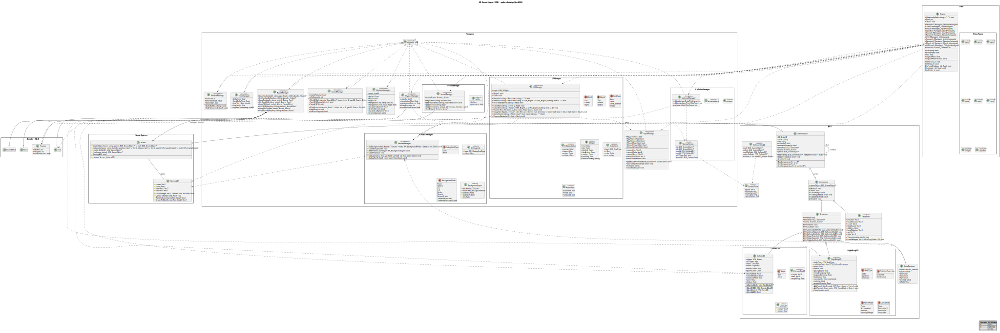
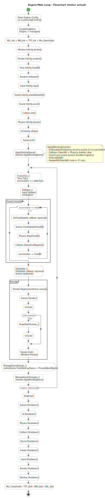

# XEngine (SDL2) — Engine Documentation

> **Project context:** XEngine is a lightweight 2D game engine built on top of **SDL2** (+ SDL_image, SDL_ttf, SDL_mixer).  
> It follows a **Unity-like workflow** (Scene → GameObjects → Components/Behaviours) and organizes most subsystems as **manager singletons** (window, input, rendering, assets, audio, scenes, collisions, physics, UI, random, time).

---

## 1. High-Level Overview

XEngine is designed to build small-to-medium 2D games with a codebase that stays **simple, explicit, and extendable**.

Core ideas:
- **Scenes** contain and own all game objects.
- **GameObjects** are lightweight entities that aggregate **Components**.
- **Components** implement functionality; **Behaviours** are Components with enable/disable and gameplay callbacks (Unity-like).
- A central **Engine loop** updates managers, runs fixed-step physics, updates gameplay, renders, and safely applies queued changes (destroyed objects / scene switches).

The design balances:
- **Low-level control** (plain C++, SDL renderer, explicit managers)
- **High-level ergonomics** (BaseTypes math, C#-style properties, safe lifecycle, caching asset pipeline)

---

## 2. Project Structure

Conceptually, the engine is split into:

### 2.1 Core
- **Engine**: orchestrates startup/shutdown and the full game loop.
- **BaseTypes**: math + utility value types used everywhere (vectors, rects, colors, helpers).
- **Singleton**: template singleton used by managers.
- **ErrorHandler / Logging**: centralized error reporting.
- **Property system**: C#-style `.position`, `.zoom`, `.viewRect`, etc. in C++.

### 2.2 Scene & Entity System
- **Scene**
  - Owns all objects (`std::vector<std::unique_ptr<GameObject>>`)
  - Runs global lifecycle (`AwakeAll`, `StartAll`, `FixedUpdate`, `Update`, `Render`)
  - Provides safe creation/destruction through queues
- **GameObject**
  - Has an ID, name, hierarchy (parent/children)
  - Holds a list of `Component`s
  - Dispatches lifecycle and collision/trigger events to components/behaviours
- **Component**
  - Base class for everything attached to a GameObject
  - Unity-like lifecycle + loops (`Awake/Start/FixedUpdate/Update/Render/OnDestroy`)
- **Behaviour**
  - A component that can be enabled/disabled at runtime
  - Adds hooks like `OnEnable`, `OnDisable` and collision/trigger callbacks

### 2.3 Managers (Singletons)
- **WindowManager**: SDL_Window creation, resolution/fullscreen, close events
- **RenderManager**: SDL_Renderer, camera world→screen conversion, debug draw, backgrounds/parallax
- **InputManager**: keyboard/mouse states (pressed/down/released), mouse world position, text input buffer
- **TimeManager**: deltaTime, fixedDeltaTime, timeScale, timestamps
- **AssetManager**: cached loading of textures/fonts/sfx/music, base asset folder
- **SoundManager**: music + SFX playback, channels, optional ducking
- **SceneManager**: scene registry and safe switching
- **CollisionManager**: broadphase + narrowphase, trigger/collision dispatch
- **PhysicsManager**: rigidbody integration + impulse solve + positional correction (substeps for fast bodies)
- **UIManager**: immediate-mode UI widgets
- **RandomManager**: seeded RNG utilities

### 2.4 UML Class Diagram

---

## 3. BaseTypes (Math & Common Value Types)

**BaseTypes** is the shared foundation used across rendering, physics, UI, and gameplay.

Key goals:
- Avoid scattering raw SDL structs across the engine.
- Provide small **value types** that are easy to copy, pass, serialize, and debug.
- Keep math consistent across all subsystems.

Typical contents:
- **Vectors**: `TVec2<T>`, `TVec3<T>` and aliases such as `Vec2f`, `Vec2i`, `Vec3f`
- **Rectangles**: `TRect<T>` and aliases such as `Rectf`, `Recti`
- **Color**: RGBA value type used by renderer and UI
- **Math utilities**: clamp, lerp, dot, length, normalize, angle helpers, epsilon comparisons

Why this matters:
- Physics contacts, camera conversions, sprite placement, and UI layouts all share the same types.
- Less friction when moving data between systems (world-space <-> screen-space, float <-> int).

---

## 4. Property System (C#-Style API in C++)

XEngine includes a `Property` / `PropertyRO` system to expose clean gameplay APIs without exposing internal state.

### 4.1 Motivation
In Unity, you naturally write:
- `transform.position = ...`
- `camera.zoom = ...`
- `rect = camera.viewRect` (read-only)

In raw C++, that often becomes:
- verbose getters/setters
- or public fields (harder to validate / maintain invariants)

Properties provide:
- **Readable syntax**
- **Controlled access** (read-only vs read/write)
- **Encapsulation** (setters can mark dirty flags, clamp values, trigger callbacks)

### 4.2 Property types
- **PropertyRO**: read-only property (returns from a getter)
- **Property**: read/write property (getter + setter)

Example: Camera exposes a read-only `viewRect` and editable `center`/`zoom` via properties (pattern shown in Camera code). This gives a clean API while keeping the implementation private.

---

## 5. Startup & Configuration

### 5.1 Startup sequence
`Engine::Start()` typically:
1. Loads configuration (JSON) or defaults
2. Initializes SDL subsystems (video + audio + image/ttf/mixer)
3. Creates/initializes managers in dependency order:
   - Window → Renderer → Time → Random → Input → Assets → Sound → Collision → Physics → UI → Scenes
4. Loads a default font for UI/debug
5. Marks engine ready to run

### 5.2 Configuration
A JSON config file usually defines:
- Window: size, fullscreen, title
- Rendering: vsync, acceleration
- Time: fixed timestep
- Assets: base folder
- Audio: channels, master volume, ducking
- Physics: gravity and solver parameters
- UI: default style values

---

## 6. Main Game Loop (How It Works Internally)

The engine is single-threaded by default and follows a stable classic loop:

1. **Time tick**
   - `TimeManager::Tick()` updates delta time (with timeScale)
2. **Input polling**
   - `InputManager::Update()` stores pressed/down/released for keyboard + mouse
3. **FixedUpdate**
   - Accumulator loop:
     - while `accumulator >= fixedDt`, run fixed step(s)
   - Used for physics and deterministic logic
4. **Update**
   - Variable time gameplay logic using `deltaTime`
5. **Render**
   - Render current scene using active camera through RenderManager
6. **Safe queues**
   - Flush destroy queue (remove objects safely after updates)
   - Apply pending scene switch

This avoids deleting objects during iteration and keeps lifecycle deterministic.

### 6.1 Engine Flowchart

---

## 7. Scene System & Lifecycle

### 7.1 Ownership and safe destruction
- A `Scene` owns `GameObject` instances (`unique_ptr`).
- `DestroyObject()` enqueues IDs.
- `FlushDestroyQueue()` removes objects in a safe moment (after updates).

### 7.2 Unity-like lifecycle
For each GameObject and its Components:
- **Awake**: once when scene loads
- **Start**: once before first frame
- **FixedUpdate / Update / Render**: per frame (if active)
- **OnDestroy**: cleanup hook

Behaviours add:
- **OnEnable / OnDisable** when activation changes

### 7.3 Instantiation workflows
XEngine supports both:
- **Prefab-like cloning** (copy an existing GameObject tree)
- **Builder-style instantiation** (recommended extension / workflow)
  - `Instantiate(name, lambda(go){ ...add components... })`

The builder approach avoids complex generic cloning and makes construction explicit.

---

## 8. GameObject, Components, and Transform

### 8.1 Composition model
- A `GameObject` is a container of Components.
- Components implement behaviour (render, physics, scripts).
- Some components are *unique* (e.g., Transform-like pattern).

### 8.2 Hierarchy
- GameObjects can be parented.
- Transform works with local/world conversions and caching (dirty flags).
- Parent transforms affect children automatically.

---

## 9. Rendering System

### 9.1 Renderer backend
- Uses `SDL_Renderer` for drawing.
- RenderManager provides world-space and screen-space draw calls.

### 9.2 Sprite rendering
`SpriteRenderer` typically supports:
- Texture + source rectangle (spritesheets)
- Tint (RGBA)
- Rotation + pivot (0..1)
- Flip X/Y
- Local offsets

### 9.3 Camera2D
Camera provides:
- Center position
- Zoom
- Base view size
- World <-> screen conversion
- Follow and clamp helpers

### 9.4 Debug tools
- Debug lines/rectangles (world space)
- Optional stats overlay (FPS, frame time, draw calls)

---

## 10. Assets Layer (SDL Wrappers + Caching)

XEngine wraps SDL resources into **move-only C++ asset types** instead of passing raw pointers everywhere.

### 10.1 SDL wrapper types
The engine defines wrappers:
- `Texture` wraps `SDL_Texture*`, stores width/height and supports pixels-per-unit metadata
- `Font` wraps `TTF_Font*`
- `SoundEffect` wraps `Mix_Chunk*`
- `Music` wraps `Mix_Music*`

Important design points:
- They are **move-only** (copy disabled) to avoid double-free and accidental shared ownership
- Destructors release the underlying SDL resources (RAII)
- Internal access uses `GetSDL()` for systems that must call SDL directly (e.g., RenderManager / SoundManager)

### 10.2 AssetManager caching
`AssetManager` is responsible for:
- Loading assets once and caching them (by path and/or by logical key).
- Storing them as `std::unique_ptr<...>` in internal maps (textures, fonts, sfx, music).
- Providing `LoadX()` and `GetX()` methods (plus `ByKey` variants).

This keeps:
- file I/O and SDL load calls centralized
- consistent error handling/logging
- stable asset lifetime across the whole game

---

## 11. Audio System (SoundManager)

SoundManager handles playback using the asset wrappers above.

Key features:
- Configurable SFX channel pool (default example: 32 channels)
- Global master volume applied to music and SFX
- Optional **ducking** (reduce music volume while SFX are playing) with tunable duck volume and attack/release timings

Public API overview:
- Music: `PlayMusic(...)`, `StopMusic()`, `IsMusicPlaying()`
- SFX: `PlaySFX(...)`, `StopAllSFX()`, `StopSFXChannel()`, `IsAnySFXPlaying()`
- Runtime tuning: `SetMasterVolume()`, `SetSFXChannelCount()`

---

## 12. Input System

InputManager supports:
- Keyboard: down / pressed / released
- Mouse buttons: down / pressed / released
- Mouse position + delta + wheel
- Text input buffer (useful for UI and debug tools)
- World-space mouse position via camera conversions

---

## 13. Collision & Physics

### 13.1 CollisionManager
Responsible for:
- Broadphase pair generation
- Narrowphase collision tests (OBB/Circle combinations)
- Trigger vs solid handling
- Event dispatch:
  - `OnCollisionEnter/Stay/Exit`
  - `OnTriggerEnter/Stay/Exit`

Collision info can include contact points (point/normal/penetration) for physics response.

### 13.2 PhysicsManager
Provides:
- Rigidbody integration (gravity, damping, constraints)
- Impulse-based solver (restitution)
- Positional correction to reduce overlap/sinking
- Substepping for fast bodies (lightweight CCD approach)

---

## 14. UI System (Immediate Mode)

UIManager provides a compact immediate-mode UI:
- Panels, labels, images
- Buttons (with hover/active states)
- Invisible buttons
- Checkbox / progress bar (if included in your build)

The UI renders in screen-space and uses fonts/textures from AssetManager.

---

## 15. Two Games Built With XEngine

Two small games were developed to validate XEngine in real projects and showcase different engine features in practice.

---

### Game 1 — Blob’s Quest
- **Genre:** Top-down / twin-stick shooter
- **Core mechanics:** Move, shoot, avoid enemies, collect coins to increase score.
- **Engine features showcased:**  
  Input handling, Scene management (restart/reload), Physics + Collisions (enemies/projectiles/pickups), UI (score + health bar + restart button), SFX + Music through the Asset pipeline.
- **Notable implementation detail:**  
  The floor/background uses a **tiled physical background mode** instead of spawning many GameObjects, keeping the scene lightweight and efficient.
- **Gameplay:**

  

---

### Game 2 — My Princess Run
- **Genre:** Endless runner
- **Core mechanics:** Jump and avoid obstacles while the run speed and score increase.
- **Engine features showcased:**  
  SpriteRenderer + animation via custom Behaviour, runtime instantiation/spawning, Physics + Collisions for obstacle hits, UI image buttons, multi-layer parallax backgrounds.
- **Notable implementation detail:**  
  The game uses a **“treadmill” scrolling approach** (environment moves and wraps) plus **parallax layers** at different speeds to add depth.
- **Gameplay:**

  

---

## 16. Extending XEngine (Planned / Possible Improvements)

XEngine is designed to be extended. Possible next steps:

### 16.1 Multithreading (Recommended extension)
A natural evolution is adding **multithreading** to reduce frame time and improve scalability.

Good candidates for parallel work:
- **Asset loading** on a background thread  
  (async texture/audio loading + main-thread upload to SDL renderer when ready)
- **Physics** running in its own step thread 
- **Rendering** on its own thread to improve FPS
  (careful sync point before rendering; double-buffer transforms/contact data)
- **Collision broadphase** / spatial partitioning updates in parallel
- **Audio mixing / streaming** improvements (depending on backend constraints)
- **Job system** (thread pool) with small tasks: AI updates, animation updates, particle updates

### 16.2 Tooling & workflow
- Scene serialization (save/load scenes to JSON)
- Editor/debug tooling (in-engine debug UI, gizmos, inspectors)
- Hot-reload for textures/audio/fonts

### 16.3 Rendering upgrades
- Sprite batching / sorting by texture to reduce draw calls
- Animation system (spritesheets + state machines)
- Particle system
- 2D lighting

### 16.4 Physics upgrades
- Friction (static + dynamic)
- Better contact manifolds (multiple contacts)
- Joints (distance/hinge/spring)
- True swept-shape CCD

### 16.5 UI upgrades
- Layout system (vertical/horizontal layout groups)
- Input widgets (sliders, text fields)
- UI scaling for different resolutions/aspect ratios

---

## 17. Conclusion

XEngine provides a complete foundation for building 2D games in C++/SDL:
- Clean Scene/GameObject/Component architecture with predictable lifecycle
- Stable engine loop with fixed-step physics
- Camera-based rendering with sprites, debug tools, and UI
- Strong developer ergonomics via **BaseTypes** and the **Property system**
- Robust resource management through an **asset-wrapper layer** and caching manager
- A clear path for future extensions such as **multithreading**, tooling, and advanced rendering/physics